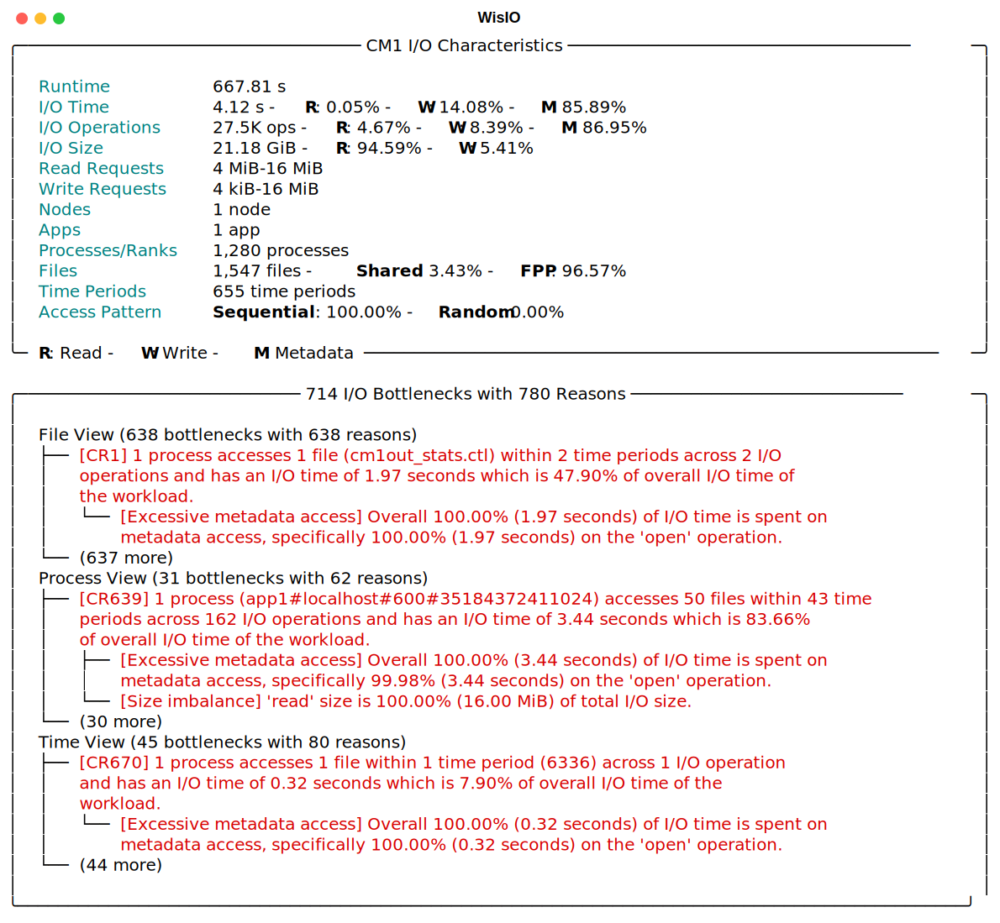

# Quickstart

{{wisio}} is distributed on [PyPI](https://pypi.org/project/wisio/). To start using {{wisio}}, install it through `pip`:

```bash
pip install wisio
```

Analyze I/O traces by providing the `analysis` and `trace_path` parameters:

```bash
wisio analysis=darshan analysis.trace_path=/path/to/darshan/trace
wisio analysis=dftracer analysis.trace_path=/path/to/dftracer/pfw
wisio analysis=recorder analysis.trace_path=/path/to/recorder/parquet
```

By default the output is stored in a folder named `.wisio` in the current directory. This directory can be configured using the `hydra.run.dir` configuration parameter.

To see available configuration parameters, run `wisio --help`:

```bash
$ wisio --help
WisIO is powered by Hydra.

== Configuration groups ==
Compose your configuration from those groups (group=option)

analysis: darshan, dftracer, recorder
checkpoint: disabled, enabled
cluster: local, lsf, pbs
output: console, csv, json, sqlite


== Config ==
Override anything in the config (foo.bar=value)

analysis:
  bottleneck_dir: ${hydra:run.dir}/bottlenecks
  trace_path: ./trace.darshan
  type: DARSHAN
  exclude_bottlenecks: []
  exclude_characteristics: []
  metrics:
  - iops
  logical_view_types: false
  threshold: 45
  time_granularity: 1000000.0
  view_types:
  - file_name
  - proc_name
  - time_range
checkpoint:
  dir: ${hydra:run.dir}/checkpoints
  enabled: false
cluster:
  type: LOCAL
  dashboard_port: 0
  debug: false
  host: ''
  local_dir: /tmp/.wisio/worker_dir
  memory: 0
  n_threads_per_worker: 16
  n_workers: 8
  processes: false
output:
  type: CONSOLE
  compact: true
  group_behavior: false
  max_bottlenecks: 2
  name: ''
  root_only: true
  show_debug: false
  show_characteristics: true
  show_header: true
  view_names: []
debug: false
verbose: false


Powered by Hydra (https://hydra.cc)
Use --hydra-help to view Hydra specific help
```

Once the analysis is completed, {{wisio}} outputs the following report to the console (by default).


